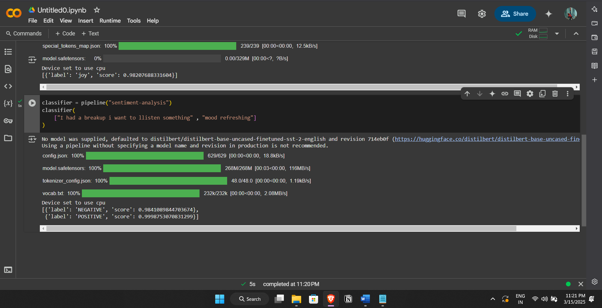
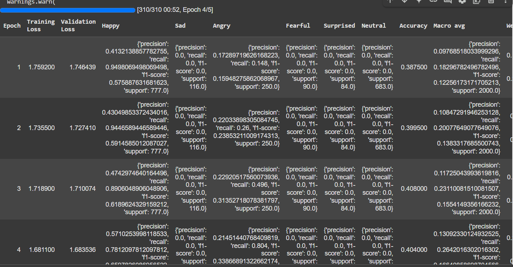
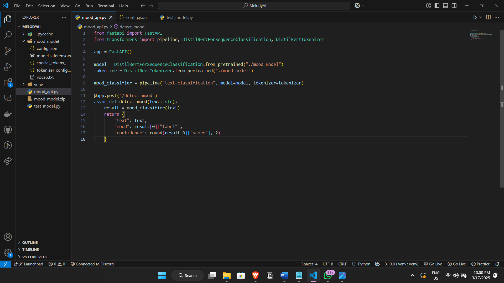
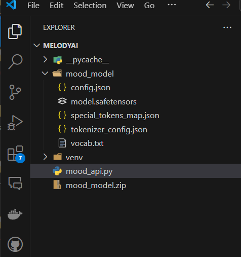
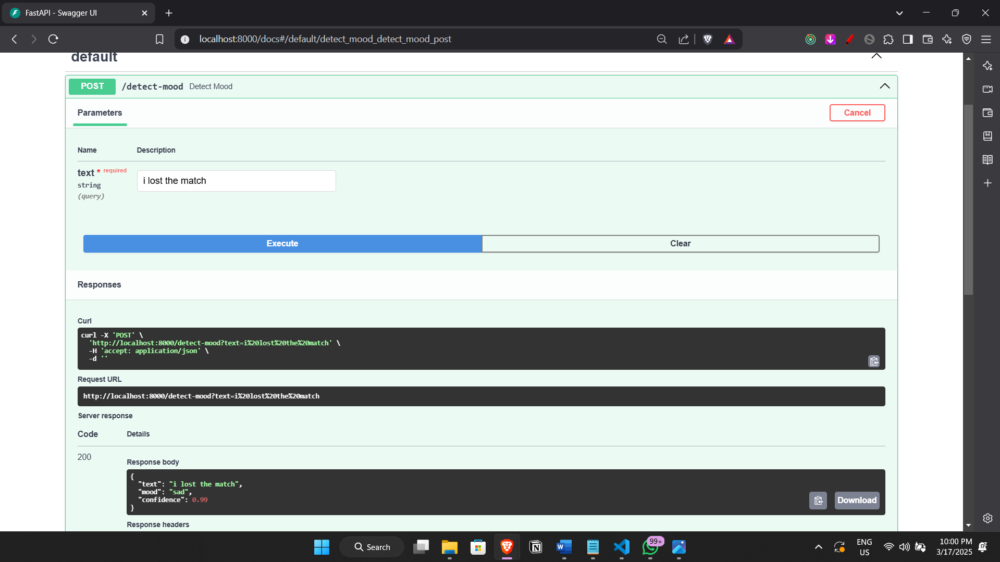
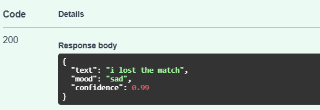
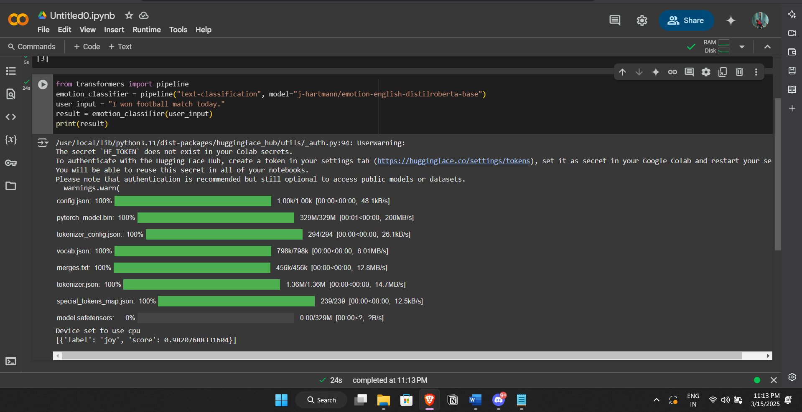

# Emotion Detection with Fine-Tuned DistilBERT

This project implements an emotion detection system using a fine-tuned DistilBERT model. Originally built for binary sentiment classification (positive/negative), the approach was extended to classify text into a broader set of emotions by leveraging the Go-Emotions dataset.

## Firstly

- **Initial Approach:**  
  The project started by using a DistilBERT model for text classification into two labels (positive and negative).  
  

- **Dataset – Go-Emotions:**  
  I used the [Go-Emotions](https://huggingface.co/datasets/go_emotions) dataset from Hugging Face, which contains 28 distinct emotion labels. For this project, these 28 emotions were remapped into 6 broader categories to simplify the classification task and focus on key emotional responses.

## Model Training

Two rounds of fine-tuning were performed:

1. **Initial Training:**  
   - **Epochs:** 2  
   - **Learning Rate:** 2e-5  
   - **Duration:** ~20 minutes  
   - **Resulting Accuracy:** ~48%

2. **Extended Training:**  
   - **Epochs:** 5  
   - **Learning Rates:** 3e-5 and 5e-5  
   - **Duration:** ~4.5 to ~6 hours  
   - **Resulting Accuracy:** Between 81% and 92%

  

## API Integration

After fine-tuning, the model was downloaded and integrated into a FastAPI application for testing and deployment. The FastAPI interface allows for easy interaction with the model via REST endpoints.

- **API Interface:**  
  

- **Directory Structure:**  
  

- **FastAPI Endpoints:**  
    
  

## Alternative Model

During development, the [j-hartmann/emotion-english-distilroberta-base](https://huggingface.co/j-hartmann/emotion-english-distilroberta-base) model was also explored. This model is fine-tuned directly on emotion data and provides direct emotion labels, offering a valuable benchmark and alternative approach to emotion classification.

## Suggestions & Next Steps

- **Data Augmentation:**  
  Consider using data augmentation techniques to further improve model robustness.

- **Hyperparameter Tuning:**  
  Experiment with additional hyperparameters (e.g., batch size, weight decay, optimizer choice) to possibly enhance performance.

- **Model Comparison:**  
  Evaluate the custom fine-tuned model against the [j-hartmann/emotion-english-distilroberta-base](https://huggingface.co/j-hartmann/emotion-english-distilroberta-base) model to understand the trade-offs in accuracy and label specificity.

- **API Enhancements:**  
  Expand the FastAPI application with more endpoints, logging, and error handling to support further development and production readiness.
